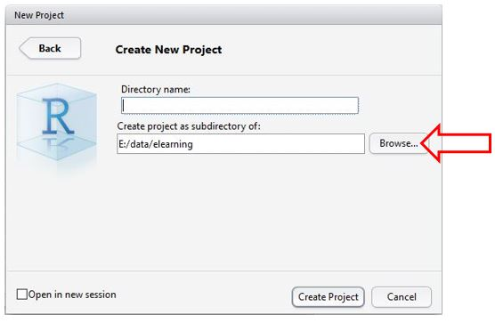
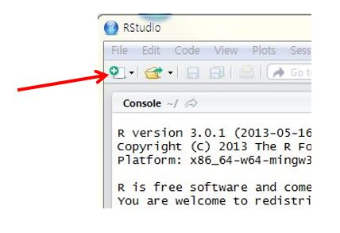
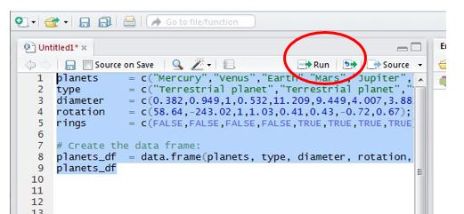
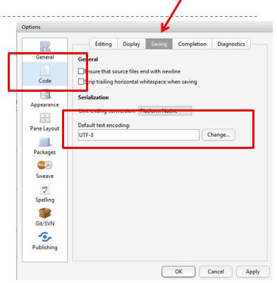

# 준비1: R기초 {#prep1}


## 기본 개념

### 컴퓨터

컴퓨터는 범용계산기계다. '범용'이란 수행할 수 있는 과제가 특정 영역에 국한되지 않는다는 의미다. 즉, 컴퓨터는 인간처럼 모든 영역의 과제를 수행할 수 있다. 컴퓨터는 인간과 달리 수행해야 하는 과제를 인간이 지정해야 한다. 인간은 해결해야 하는 문제를 스스로 설정한다. 

컴퓨터는 하드웨어와 소프트웨어로 이뤄져 있다. 

하드웨어 중앙처리장치(CPU), 저장장치, 입출력기기, 통신장치 등으로 이뤄져 있다.


#### 하드웨어

범용계산기계(컴퓨터)를 작동하도록 하는 기계부품이다. 

  - 중앙처리장치: 과제 수행에 필요한 계산 수행
  - 저장장치: 계산에 필요한 자료를 임시로 저장하는 내장메모리와 자료를 장기간 저장하는 외부저장장치로 구분한다. 내장메모리는 과제 수행에 필요한 자료를 올려 놓는 작업대에 해당한다. HDD 등 외부저장창치는 자료를 장기간 저장하는 일종의 창고로서 도서관의 서고에 해당한다. 
  - 입출력기기: 키보드 마우스 모니터 등 입력과 출력을 처리하는 기기다. 
  - 통신장치: 인터넷 등에 연결하는 기기


#### 소프트웨어

범용계산기계(컴퓨터)의 작동에 필요한 신호체계다. 알고리듬과 자료(data)구조로 이뤄져 있다.

  - 알고리듬(algorithm): 문제를 푸는 방도.   기계가 수행해야 할 특정 과제를 순서대로 알려주는 구체적인 지시의 집합이다. 알고리즘이라고도 하지만, 알고리듬이 더 정확한 표현이다. algorism은 페르시아의 수학자 알-콰리즈미의 이름에서 유래한 용어로서 '숫자를 이용한 연산'이란 의미다. 

  
  - 자료구조: 데이터를 조직하는 특정한 방법. 예를 들어, 벡터(vector)는 자료의 값(value)을 나열한 자료구조고, 데이터프레임(data frame)은 자료의 값을 행(row)과 열(column)의 테이블 구조에 저장하는 자료구조다. 
 

#### 프로그래밍 언어
알고리듬을 표현하는 방식. 컴퓨터언어라고도 한다. 기계어, C, 자바, 파이썬, R 등이 있다. 프로그래밍은 알고리듬대로 소프트웨어를 만드는 작업이다. 


- 기계어: 컴퓨터가 직접적으로 이해할 수 있는 언어. 
  - 가장 "낮은"  수준. 0과 1로만 이뤄짐
- Fortran: 최초의 높은 수준의 범용 프로그래밍 언어. 인간의 언어에 유사
  - 1954년 IBM의 John Backus 개발
- C: 1970년대 개발이후 가장 널리 사용됐던 언어. compiled 언어
- Java: 컴파일 한번만 하면 모든 플래폼에서 실행. compiled 언어

**컴파일드(Compiled)언어**
소스코드를 기계어로 미리, 한번에 번역한다. 

예를 들어, C언어의 경우 소스코드를 실행프로그램으로 한번에 컴파일해 사용한다. 

- 소스코드 `samepl..c`
```
#include(studio.h)
int main()
{
  print("Hello World!"\n
  return 0;
}
```

- 컴파일 `gcc sample.c-o sample.exe`

- 기계어: `sample.exe`

```
000111110000011111000000000011111111110101010101010000000000000100000000000000000001111111100000000000000000000000000000

```

C, Java 등 컴파일드 언어(complied language)는 코드를 한번에 기계어로 변환한다. 한번에 변환하므로 실행이 빠르고 간편하다. 독립 소프트웨어 개발에 유리하다. 


**인터프리티드(interpreted)언어**
프로그래밍 코드를 한줄씩 해석(기계어로 번역)해 실행한다. 한줄씩 해석하므로 코드 수정이 용이하다. 명령프롬프트 ( > )에 명령어를 한번에 하나씩 입력해서 실행한다. 바로 실행하므로 데이터분석에 편리하다. 


- JavaScript: 웹페이지 개발 등에 널리 사용. Java와 다른 언어
- Python: 높은 수준의 범용, 인터프리티드 언어
  - C/C++, Java보다 더 높은 수준. 인간이 이해하기 더 수월하다. 
- R: 데이터분석에 특화된 높은 수준의 인터프리티드 언어


### R

통계학자에 의해 개발된 오픈소스 컴퓨터프로그래밍언어다.

#### R 약사

- 1976년 John Chambers, R 전신인 S언어 발표 
  - Bell Labs
- 1994년 Ross Ihaka & Robert Gentleman R 발표
  - 뉴질랜드 오클랜드 대학
- 1997년 GNU project에 포함
- 현재 R Development Core Team이 개발 및 유지


#### R의 장점

- 데이터 분석에 필요한 모든 기법 구현 가능
- 최신 통계 기법 신속 반영
- 뛰어난 그래픽 처리
- 데이터 탐색과 분석에 용이
- 다양한 플래폼에서 작동(윈도, 리눅스, 유닉스, 맥 등)
- 다양한 데이터 소스에 접근 가능
  - 텍스트파일부터 데이터베이스관리시스템, 통계패키지 등
  - 웹페이지, 소셜미디어 사이트 등 다양한 온라인 데이터 서비스에 직접 접근


## R시작하기

R을 이용하는 방법에는 로컬컴퓨터(자신의 컴퓨터)와 클라우드를 이용하는 방법 2가지가 있다. 

1. 컴퓨터에 R을 설치해 이용

- 장점: 내 컴퓨터에서 사용하므로 편의성이 높다. 
- 단점: 컴퓨터 사양이 낮으면 매우 불편하다. 

2. 클라우드에서 R 이용

- 장점: 컴퓨터 사양이 낮아도 브라우저만 있으면 된다.
- 단점: 매번 패키지를 설치해야 한다. 

[R Studio 클라우드](http://studiocloud.com/)와 [구글 코랩](http://colab.to/r) 등이 R클라우드다. 구글 코랩의 기본값은 파이썬이지만, [이 주소](http://colab.to/r)로 연결하면 R이 사용언어로 설정된다.  

### 로컬컴퓨터에 설치하기

1. R project사이트에서 접속
[이 주소(cloud.r-project.org)](https://cloud.r-project.org/)로 직접 접속하거나, 구글에서 "r project" 검색

2. 본인의 운영체제에 맞는 R다운로드 후 설치. 
R을 설치하고 실행하면 콘솔 창이 열린다. `>` 프롬프트가 뜨면 정상이다 (Figure: \@ref(fig:rconsole)). 

```{r rconsole, echo=F, fig.cap="R 콘솔", dpi=30}
knitr::include_graphics("images/Rconsole.jpg")

```


### R의 기능구현

함수와 객체를 통해 기능을 구현한다. 

#### 함수(function)

특정 동작을 수행하는 컴퓨터프로그램의 일부. 알고리듬이 함수에 구현돼 있다. 언어로 따지면 동사에 해당한다. 예를 들어, `+`는 '더하기 하라'는 동작을 지정한 함수이고, `mean()`은 '평균을 계산하다'는 동작을 지정한 함수다. `q()`는 R을 종료하라는 동작을 지정한 함수다. 

 - 내장 함수
 R을 설치하면 기본적으로 함께 제공되는 함수. R함수라고 줄여 말하기도 한다. 
 
 - 패키지 함수
 추가로 설치하는 패키지에서 제공하는 함수. (패키지는 R함수, 데이터, 완성된 코드를 정리해 종합한 꾸러미다.)   
 
 - 사용자 생성 함수
 사용자가 자신의 편의를 위해 만든 맞춤형 함수다. 예를 들어, 평균, 중간값, 표준편차를 한번에 계산하고 싶으면 `mean()` `median()`, `sd()` 등 3개 함수를 모아 하나의 함수로 만들면 사용자 생성함수가 된다. 


#### 객체(object)

값(value)을 할당한 것. 데이터, 함수, 그래프, 분석결과 등을 할당해 객체를 생성한다. 언어로 따지면 명사에 해당한다. 

아래 예시는 x라는 객체에 "Hello World!"라는 문자벡터를 할당해 객체를 만들었다. 벡터(vector)는 데이터의 구조중 가장 기본이 되는 구조다. 

```{r prep2}
x <- "Hello World!"

```

할당할 때는 `<-`기호를 사용한다. `=`를 사용해도 된다. 다른 프로그래밍 언어에서는 객체를 생성할 때 값을 할당하기 위해 `=`를 주로 사용한다. R프로그래밍에서는  `<-`를 주로 사용한다. `=`를 이용해 할당하면 오류가 생기는 경우가 가끔 있다. 

- 생성된 객체는 내장 메모리에 저장된다. 객체를 따로 저장하지 않으면, R세션을 종료시 생성된 객체는 사라진다. 객체를 다시 사용하려면 외부저장장치(예: HDD)에 파일로 저장해야 한다. 

생성한 객체의 내용을 보는 방법은 다양하지만, 가장 기본적인 방법은 `print()`함수다. 

```{r prep3}
print(x)
```


##### 연습

1. x에 숫자 10을 할당하고, y에 숫자 20을 할당해 x와 y를 더하는 코드를 작성하시오.

```{r prep4}
x <- 10
y <- 20 
x + y

```


2. x에 문자 10을 할당하고, y에 문자 30을 할당해 x와 y를 더하는 코드를 작성해 위 1번의 결과와 비교하시오. 

```{r prep5, eval=FALSE}
x <- "10"
y <- "20" 
x + y

```

"Error in x + y : 이항연산자에 수치가 아닌 인수입니다"라는 오류메시지가 나타난다. 숫자라도 따옴표`" "`로 감싸면 문자형이 된다. 작은 따옴표`' '`로 감싸도 문자형이 된다. 

문자는 `paste()`함수로 결합한다.

```{r prep5-1}
paste(x, y, sep = " ")

```


#### 인자(argument, parameter)

함수 실행에 필요한 데이터, 실행방식 등을 지정하는 내용이다. 함수는 동사, 객체는 명사에 해당한다면, 인자는 목적어나 수식어 등에 해당한다. 예를 들어, 아래의 코드에서 `sep = `인자를 투입해 x와 y의 값이 결합하는 작동하는 방식을 지정한다. 아래 코드는 x와 y의 값 사이에 "과 "를 넣으라는 의미가 된다. 

```{r prep5-2}
paste(x, y, sep = "과 ")

```

`paste()`함수의 `sep = `인자 기본값은 `" "`이다. 기본값은 따로 지정하지 않아도 된다. 즉, `paste(x, y)`와 `paste(x, y, sep = " ")`의 산출 결과는 동일하다. 


#### 기술문(statement)
함수, 객체, 인자(argument)로 구성된 일종의 문장이다. 일련의 기술문을 작성하는 것을 “코딩”한다고 한다. 


##### 기술문 사례
`x <- rnorm(n = 500, mean = 10, sd = 4)`

- `rnorm()`: 함수
  - '정규분포를 만들라'는 명령을 컴퓨터에 전달하는 함수다. 
- `n = 500, mean = 10, sd = 4` : 인자. 
  - 평균 10, 표준편차 4을 이루는 500개의 값
- `x` : 객체
  - 평균 10, 표준편차 4을 이루는 500개의 값이 할당된 객체


#### 결과의 재사용

분석의 산출물을 객체에 할당해 재사용한다. `lm()`함수를 이용해 `mtcars`라는 데이터의 `wt`(무게)변수로 `mpg`(연료효율)변수를 예측하는 단순 회귀분석하는 기술문이다.

```{r prep6, eval=FALSE}
lm(mpg ~ wt, data = mtcars)
```

이 분석 결과는 화면에 나타날 뿐이다. 그 결과를 다시 사용하려면 객체에 할당한다. 

- `mtcars`는 R에 내장된 데이터다. (단수 복수에 주의한다. 오류의 주된 원인 중 하나가 복수 `s`누락)
- `~`는 공식(formula)을 만들때 사용하는 기호다. 
- `mpg ~ wt`는 공식(formula)이다. wt가 독립변수, mpg가 종속변수.  

아래 코드는 `fit`에 기술문을 할당한 다음, `fit`의 내용을 `summary()`함수로 요약해 출력하고, `plot()`함수로 도표를 그리라는 내용이다. 

```{r prep7, eval=FALSE}
fit <- lm(formula = mpg ~ wt, data = mtcars)
summary(fit)
plot(fit) 

```


#### 코멘트 `#`

코딩할 때 코딩한 내용에 대해 사람이 참조하기 위해 기록을 남길 필요가 있다. `#`부호가 있으면 컴퓨터엑 해석(interpret)할 필요가 없다는 의미가 돼, `#`부호 다음의 내용은 컴퓨터가 무시하고 처리하지 않고 내용을 그대로 화면에 제시하기만 한다.

```{r prep8}
x <- rnorm(5) # 이런 식으로 다음에 적힌 글자는 화면에 표시만 한다. 

```


#### 도움말

R의 모든 함수와 인자를 기억해 사용할 수 없다. 도움말을 이용해야 한다. 일반적인 도움말은 `help.start()`함수를 이용한다. 개별 함수에 대한 도움말은 `help("함수")`나 `?함수`의 형식으로 입력한다. 
  
- `c()`함수에 대해 알고 싶으면
  - `?c`
  - `help("c")`
- `mean()`함수의 도움말은: 
  - `?mean`
  - `help("mean")`


### 작업공간(workspace)

현재 실행중인 R의 작업환경이다. 사용자가 생성한 객체(object)가 저장돼 있는 곳이다. 컴퓨터의 하드디스크가 아니라 메모리에 올려져 있다. R을 종료하면 함께 사라진다. 

R을 종료할때 "Save workspace image?"라는 창이 뜬다. 작업공간에 저장된 객체는 이미지파일로 하드디스크에 저장할 것인지 묻는 메시지다. '예'를 선택하면 현재 작업공간의 객체들이 모두 `.RData`파일로 저장된다. 이 이미지 파일의 내용은 R을 다시 기동하면 작업공간으로 다시 올려진다.  

`ls()`함수는 작업공간의 객체의 목록(list)을 보여준다. 조금 전에 객체 `x`, `y`, `fit`을 만들었으므로 `ls()`함수를 콘솔에 입력하면 이 세 객체가 화면에 나타난다. 

 

`rm()`함수는 작업공간의 객체를 제거(remove)한다. `x`, `y`, `fit`를 제거하고 `ls()`함수를 실행해보자.

```{r prep9, eval=FALSE}
rm(x, y, fit)
ls()

```


### 중요: 작업디렉토리(working directory)

R이 기본값으로(by default) 파일을 읽고 저장하는 디렉토리 (또는 폴더)로서 하드디스크 공간이다.  

- `getwd()` : 현재의 작업디렉토리를 알려준다. wd는 working directory의 약자. 즉, getwd는 working directory를 get하라는 의미.

`getwd()`로 자신의 작업디렉토리를 파악해보자.

* 주의: 윈도는 드라이브명 다음에 역슬래시`C:\`를 사용하지만, R에서는 정슬래시 `C:/`를 이용한다.

- `setwd()` : 지정한 폴더를 작업디렉토리로 설정. working directory를 set하라는 의미다. 

#### 연습: C드라이브의 data폴더를 작업디렉토리로 설정하시오. 

- 주의: `" "`와 아포스트로피(apostrophe) `“ ”`는 다른 기호다. 다른 문서에서 코드 복사해 사용할때 주의. 

```{r prep10, eval=FALSE}
setwd("C:/data")

```


만일 작업디렉토리를 설정하고자 하는 폴더가 C드라이브에 없으면?

컴퓨터의 탐색기를 열어 해당 폴더를 만들거나, R콘솔에서 폴더 생성 함수`dir.create()`로 해당 폴더를 만든다. 

'newfolder'라는 폴더를 C드라이브에 만들려면?


```{r prep11, eval=FALSE}
dir.create("C:/newfolder")

```


- 연습:  C드라이브에 newdir이란 폴더를 생성하고, 이 폴더를 작업디렉토리로 설정하시오. 설정된 작업디렉토리를 확인하시오. 

```{r prep12, eval=FALSE}
dir.create("C:/newdir")
setwd("C:/newdir")
getwd()

```


- `list.files()`
현재의 작업디렉토리에 있는 파일과 폴더 목록 보여준다. 

- `ls()`는 작업공간의 객체 목록

- 주의: 작업공간(working space)은 메모리에 생성된 작업환경이고 작업디렉토리(working directory)는 HDD(하드디스크)에 생성된 폴더다. 


#### 팁
 - 키보드의 `control`키와 `L`키를 함께 누르면 콘솔 화면이 정리된다. 
 - 키보드의 상하 방향키를 이용하면 이전에 입력했던 명령어를 다시 사용할 수 있다. 


## IDE(통합개발환경: Integrated Development Environment)

R과 같은 프로그램언어를 보다 효율적으로 사용할 수 있도록 해주는 도구가 IDE다. 코드 편집기외에 다양한 부가기능이 있다. R의 대표적인 IDE가 RStudio다. 파이썬의 파이참에 해당한다. 

### RStudio 설치 

구글에서 'rstudio'를 검색하거나 이 링크 [R Studio Desktop Free]( https://rstudio.com/products/rstudio/download/#download)에서 다운로드 받아 설치한다. 

설치한 다음 아래처럼 실행되면 설치에 성공한 것이다 (Figure \@ref(fig:rstudio1)). 화면에 3개의 창틀이 열려 있는데, 각 창을 pane(창틀)이라고 한다. 

 - 왼쪽에 보이는 'Console'이라고 된 창이 R을 실행했을 때 코드를 입력했던 콘솔 창이다. R의 콘솔과 동일하므로 사용법도 같다. 
 
 - 오른쪽 위의 창이 작업공간이다. 메모리에 생성된 작업환경(Working envorionment).
 
 - 오른쪽 아래 창은 작업디렉토리. 파일이 저장돼 있는 하드디스크. 

 
```{r echo=F, rstudio1, fig.cap="R 콘솔", dpi=30}
knitr::include_graphics("images/Rstudio1.jpg")

```

### 프로젝트 만들기

작업을 할 때 반드시 프로젝트로 관리애 해야 하는 것은 아니나, 프로젝트로 만들어 작업을 관리하는 것이 상당히 유용하고 편리하다. 

- 상단 왼쪽 위에 있는 `File`을 클릭하면 드롭다운 메뉴가 열린다. `New Project`를 클릭하면 아래 창이 열린다 (Figure \@ref(fig:rstudio2)).

```{r echo=F, rstudio2, fig.cap="R 프로젝트 만들기", dpi=30}
knitr::include_graphics("images/Rstudio2.jpg")

```
위 그림에서 `New Directory`를 클릭하면 열리는 창에서 `Empty Project`를 선택하면 아래 창이 열린다. `Browse...` 버튼 클릭해 프로젝트 파일 설치할 디렉토리 선택하고, 그 아래에 생성할 디렉토리 명을 `Directory name:`에 입력한다. 아래 그림은 "E:/data/elearning"폴더를 선택한 화면이다 (Figure \@ref(fig:rstudio3)). 

```{r echo=F, rstudio3, fig.cap="디렉토리 이름 정하기", dpi=30}


```

예를 들어, `Directory name:`에 'git2015'라고 입력하고, 아래 `Create Project` 버튼을 클릭하면, "E:/data/elearning"아래 'git2015'란 폴더가 생성되면서  "E:/data/elearning/git2015"가 작업디렉토리가 된다 (Figure \@ref(fig:rstudio4)). 

- 콘솔 창에 작업디렉토리가 표시돼 있다. 
- 오른쪽 위의 작업공간 위에 새로 만든 프로젝명이 보인다. 
- 오른쪽 아래 작업디렉토리에 새로 만든 프로젝트 파일이 생성돼 있다. 


```{r echo=F, rstudio4, fig.cap="R 프로젝트 생성", dpi=30}
knitr::include_graphics("images/Rstudio4.jpg")

```

### 편집창 열기

IDE를 사용하는 하는 이유 중 하나가 편집기(Editor)를 사용하기 위해서다. 콘솔에서는 한번에 한줄만 입력해 실행하지만, 편집창에서는 코드를 여러줄을 입력해 실행할 수 있다. 아래 그림의 화살표가 가리키는 아이콘을 클릭하면 열리는 창에서 `R Script`를 선택하거나, 단축키로 `Ctrl + Shift + N`을 이용한다. 또는 상단메뉴 `File`을 클릭하면 열리는 드롭다운 메뉴에서 `New File` 선택 (Figure \@ref(fig:rstudio5)). 

```{r echo=F, rstudio5, fig.cap="R 편집창 열기", dpi=30}


```

아래처럼 편집창이 열리면 RStudio를 이용한 코딩 준비가 된 것이다 (Figure \@ref(fig:rstudio6)). 

```{r echo=F, rstudio6, fig.cap="R 편집기", dpi=30}
knitr::include_graphics("images/Rstudio6.jpg")

```

편집창에 코드를 입력하면 탭의 `Untitled`가 빨간색으로 변한다. 디스크 모양 아이콘 클릭해 파일 이름을 지정해 저장한다. 예를 들어, `2_createData`라고 파일명을 지정하면 확장자가 `.R`인 파일 `2_createData.R`이 작업디렉토리에 생긴다. 오른쪽 아래 작업디렉토리에서 생성된 파일을 확인할 수 있다  (Figure \@ref(fig:rstudio7)). 

```{r echo=F, rstudio7, fig.cap="R 파일 저장", dpi=30}
knitr::include_graphics("images/Rstudio7.jpg")

```

 
### 코드 실행

편집창에서 마우스 커서가 있는 줄의 코드를 실행하는 방법은 다음과 같다. 

- 편집창에서  `콘트롤` + `엔터`키

- RStudio 편집창 화면에서 `Run`아이콘 클릭 (Figure \@ref(fig:rstudio8)). 


```{r echo=F, rstudio8, fig.cap="R 코드 실행", dpi=30}
knitr::include_graphics("images/Rstudio8.jpg")

```
 

여러 줄의 코드를 동시에 실행하려면 실행하려는 코드를 마우스로 드랙해 설정한 다음, `콘트롤` + `엔터`키 혹은 - RStudio 편집창 화면에서 `Run`아이콘 클릭 (Figure \@ref(fig:rstudio9)). 
 
```{r echo=F, rstudio9, fig.cap="R 코드 여러 줄 실행", dpi=30}


``` 

### 한글사용 설정

한글을 사용하기 위해서는 인코딩을 해야 하는데, 운영체자가 윈도인 경우 `CP949`라는 마이크로소프트 고유의 확장완성형 인코딩을 이용한다. 이를 보편적으로 사용하는 `UTF-8`로 변경한다. 

- RStudio 상단메뉴 `Tools`를 클릭
- 드롭다운 메뉴가 열리면 `Global option` 선택 (Figure \@ref(fig:rstudio10)). 
- `Options` 창이 열리면 'Default text encoding 을 UTF-8으로 설정한다. 

 
```{r echo=F, rstudio10, fig.cap="R 코드 여러 줄 실행", dpi=30}


``` 

 
 
## 데이터의 유형(data type)

데이터는 값(value)의 성격에 따라 다양한 유형으로 구분할 수 있다. 컴퓨터가 처리하는 방식이 다르기 때문에 이 구분은 중요하다.  `typeof()`함수와 `class()`함수로 자료의 유형을 알수 있다. `typeof()`는 원시자료형(낮은 수준의 데이터 유형)을, `class()`는 높은 수준의 데이터 유형을 알려준다. 

#### 숫자형(numeric)
  - 정수형(integer): 1, 2, 3, 4, ...
    - 정수형임을 명확하게 표기하기 위해 숫자 뒤에 `L`을 추가한다: 1L, 2L, 3L, ...
  - 실수형(double): 1.12, 2.22, 3.14, 4.15, ...

#### 논리형(logical)
  - 참 `TRUE`, 거짓 `FALSE`
  - `TRUE`는 `T`, `FALSE`는 `F`로 표기 가능
  - 주의: "True", "true" 등은 논리형이 아니라 문자형.

#### 문자형(character/string)
  - "1" , "2" , "3" , ...
  - "TRUE", "True", "true", ...
  - "일", "이", "삼", "사", ...
  - "남자", "여자", ...
  - "rose", "pink", ...
  

#### 특수한 값(value)

##### `NA`
Not Available의 약어. 즉 결측값(missing value)이다. 데이터의 값(value)이 없다는 의미의 값(value)이다. 논리형이다. 결측값 여부는 `is.na()`함수를 이용한다.

```{r na}
NA
is.na(NA)
typeof(NA)
class(NA)

```

##### `NULL`

값 자체의 부재. `NA`는 값이 없다는 의미의 값이므로 값으로서 존재한다. 반면, `NULL`은 값 자체가 없다는 의미이므로 값으로서 존재하지도 않는다.  

```{r null}
NULL
is.na(NULL)
typeof(NULL)
class(NULL)

```

##### `NaN`

'Not a Number'다. 즉, 숫자가 아니라는 의미지만 숫자형이다. 

```{r}
0/0
typeof(0/0)
class(0/0)
```


##### `Inf`
 무한(infinity). 숫자형이다. 무한이나 양의 무한(`Inf`)과 음의 무한(`-Inf`) 등 양과 음의 방향이 모두 있다. 
  
```{r inf}
1/0
typeof(1/0)
class(1/0)

```
  


## 데이터구조

데이터가 저장된 데이터구조는 다양하다. 데이터를 책이라고 한다면, 데이터구조는 책을 보관하는 책장이나 서랍 캐비닛 등 에 비유할 수 있다. R에서 주로 사용하는 데이터 구조는 벡터(vector), 데이터프레임(dataframe), 리스트(list) 등 3가지다. 이외에도 매트릭스(matrix)와 어레이(array)가 있다. 5가지 데이터구조를 그림으로 표현하면 다음과 같다 (Figure: \@ref(fig:datastr1)). 

- 정확하게 말하면, 벡터는 아토믹벡터(vector)와 제네릭벡터(generic vector)고 구분할 수있다. 아토믹벡터가 일반적으로 말하는 벡터다. 제네릭벡터는 리스트(list).


```{r datastr1, echo=F, fig.cap="데이터 구조", dpi=30}
knitr::include_graphics("images/datastr.jpg")

```

### 벡터 `c()`

1차원의 데이터구조다. 개별 값(요소)를 1차원의 공간에 배치하는 데이터구조다. `c()`함수로 벡터를 만든다.  'c'는 combine 혹은 concatenate로서 값들을 '결합하다' 혹은 '연결시키다'는 의미다. 

'사과', '배', '오렌지' 등 3개 요소를 벡터에 저장해 'fruit_v'에 할당해보자.

```{r datastr2}
fruit_v <- c('사과', '배', '오렌지')

```


저장하는 데이터의 유형에 따라 벡터의 종류 결정된다. 


- 숫자형 데이터로만 이뤄졌으면 숫자벡터
  - 실수형(double) 벡터: `c(1, 2, 3)`
  - 정수형(integer) 벡터: `c(1L, 2L, 3L)`
  
- 논리형 데이터로만 이뤄졌으면 논리벡터
  - `c(TRUE, FALSE)`
  
- 문자형 데이터로만 이뤄졌으면 문자벡터
  - `c("1", "TRUE", "F", "포도", "apple")`

  - `" "`나 `' '`로 값의 앞뒤를 감싸면 문자형이 된다. 
  
*주의*:   
  
벡터를 요소를 다양한 유형으로 구성하면 단일 유형으로 강제 변환(coerce)한다. 

```{r coerce}
c(1, "1")

```


#### 요인(factor)

요인은 문자벡터인것처럼 보이지만 본질은 숫자벡터인 데이터의 구조다. 범주형(category)데이터를 다룰 때 사용하는 데이터 구조다. 예를 들어, 성(sex)이라는 범주형 데이터는 '남자'와 '여자'라는 속성을 갖고 있는데, 이때, '남자'와 '여자'라는 데이터의 속성을 문자형이 아니라 요인으로 처리하는 것이 효율적일 때가 있다. 

예를 들어 보자.  "male", "female", "female", "male" 등 4개 값을 벡터로 만들어 `sex_v`에 할당하면, `sex_v`는 문자벡터가 된다. 4개의 문자요소가 생성된다. 

- `typeof()`함수는 낮은 수준의 자료형(원시자료형)을 제시한다.
- `class()` 함수는 높은 수준의 자료형(자료구조 등)을 제시한다.


```{r datastr2-1}
sex_v <- c("male", "female", "female", "male")
typeof(sex_v)
class(sex_v)

```

문자벡터를 `factor()`함수로 요인으로 만들면 'male   female female male '이라는 글자는 그대로 보이나, `" "`가 사라진 것을 알수 있다. `typeof()`로 유형을 확인하면 정수(integer)라고 제시한다. 컴퓨터내부에서 female과 male을 각각 숫자(1과 2)로 처리했기 때문이다. 정수 1과 2에 대해 각각 female과 male이라는 "이름"을 부여한 셈이다. 이때 정수 1과 2에 부여된 값을 "이름"이라고 하지 않고 "level"이라고 한다. 즉, 문자 "female"을 1로 처리하고, 'female'이란 이름(level)에 부여하고, 문자 "male"은 2로 처리하고, 'male'이란 이름(level)을 부여한 것이다. 

```{r datastr2-2}
factor(sex_v)
typeof(factor(sex_v))

```

문자벡터뿐 아니라 숫자벡터로 요인으로 만들어 처리하면 효율적인 경우가 많다. 숫자로 돼 있어도 범주로 처리해야 하는 경우가 있기 때문이다.  

```{r datastr2-3}
num_v <- c(1, 2, 1, 2)
typeof(num_v)
class(num_v)

```
숫자형(numeric)은 "double(실수형)"과 "integer(정수형)"로 구분한다. 실수형은 소숫점이 있고, 정수형은 소숫점이 없다. 정수임을 명확하게 표현하기 위해서 `1L` `30L`처럼 숫자 뒤에 `L`을 붙인다.  

```{r}
int_v <- c(1L, 2L, 1L, 2L)
typeof(int_v)
class(int_v)

```

숫자벡터인 `num_v`를 `factor()`함수로 요인으로 바꿔보자. 유형은 정수이나 클래스는 요인이다. 

```{r datastr2-4}
factor(num_v)
typeof(factor(num_v))
class(factor(num_v))

```


#### 부분선택(subsetting)

'fruit_v'에 할당된 세개의 값에는 위치가 숫자로 부여돼 있다. 따라서 그 위치에 대한 숫자로 해당 요소만 부분선택(subset)할 수 있다. 첫번째 요소를 부분선택 해보자. 

- R은 인덱싱할 때 첫번째 요소를 '1'에서 시작한다. (파이썬 등 다른 프로그래밍언어는 '0'에서 시작). 즉, R은 인간의 직관대로 첫번째 요소는 '1', 두번째 요소는 '2'가 된다. 

```{r datastr3}
fruit_v <- c('사과', '배', '오렌지')
fruit_v[1]

```

첫번째와 세번째 요소를 부분선택하려면 숫자벡터를 만들어 실행하면 된다. 

```{r datastr4}
fruit_v[c(1, 3)]

```

특정 요소를 제외하고 부분선택하려면 `-`기호를 이용한다. `fruit_v`에서 첫번째와 세번째 요소를 제외해 부분선택해보자. 

```{r datastr4-1}
fruit_v[-c(1, 3)]

```


#### 연습


1. 문자 '참가자1, 참가자2, 참가자3'으로 이뤄진 문자벡터를 만들어 id_v에 할당하시오.

```{r datastr5-1}
id_v <- c("참가자1", "참가자2", "참가자3")

```


2. 숫자 '32, 33, 45'로 이뤄진 숫자벡터를 만들어 age_v에 할당하시오

```{r datastr5-2}
age_v <- c(32, 33, 45)

```

3. 논리값  'TRUE, FALSE, TRUE'로 이뤄진 논리벡터를 만들어 status_v에 할당하시오.

```{r datastr6}
status_v <- c(TRUE, FALSE, TRUE)

```

4. 숫자 '60, 56, 50'으로 이뤄진 숫자벡터를 만들어 weight_v에 할당하시오.

```{r datastr7}
weight_v <- c(60, 56, 30)

```


5. 숫자 '167, 160, 155'로 이뤄진 숫자벡터를 만들어 height_v에 할당하시오.

```{r datastr7-1}
height_v <- c(167, 160, 155)

```

### 데이터프레임 `data.frame()`

행과 열로 구성된 2차원의 데이터구조다. 1차원 데이터구조인 벡터를 모아 만든다. `data.frame()`함수로 만든다. 앞서 만든 문자벡터, 숫자벡터, 논리벡터 5개를 이용해 데이터프레임을 만들어 'df'에 할당해 보자. 

```{r datastr8}
df <- data.frame(id_v, age_v, status_v, weight_v, height_v)
```


`summary()`함수로는 각 변수(열)의 값에 대한 요약을 볼수 있다. 

```{r datastr8-1}
summary(df)
```


`str()`함수는 데이터구조를 보여준다. 'structure'의 준말이다. 

```{r datastr8-2}
str(df)
```

"'data.frame':	3 obs. of  5 variables:"이라고 요약해 준다. 3개 행(row)과 5개 열(column)로 이뤄진 데이터프레임이란 의미다. 

 "obs."는 observation의 준말이다. 자료를 수집하면 행에는 개별 사례를 투입하고 변수를 열에 투입하기 때문에 행은 "obs.", 열을 "variables"이라고 표현했다 (Figure: \@ref(fig:datastr9-1)).
 
```{r datastr8-1a, echo=F, fig.cap="행렬 구조의 데이터프레임", dpi=30}
knitr::include_graphics("images/dataframe.png")

``` 
 
데이터프레임을 엑셀같은 스프레드시트 방식의 행렬로 보고 싶으면 `View()`함수를 이용한다. 별도의 창에서 행렬로 정렬된 데이터프레임이 열린다 (Figure: \@ref(fig:datastr9-1)). 
 
```{r datastr9, eval=FALSE}
View(df)

```


```{r datastr9-1, echo=F, fig.cap="View()함수로 보는 데이터프레임", dpi=30}
knitr::include_graphics("images/View.png")

```


데이터프레임 열이름의 기본값은 열벡터의 이름이 그대로 사용된다. 별도로 이름을 부여할수도 있다. 
 
```{r datastr10}
df <- data.frame(ID = id_v, 
                 age = age_v, 
                 status = status_v, 
                 weight = weight_v, 
                 height = height_v)
str(df)


```
 
#### 부분선택(subsetting)

데이터프레임은 열벡터로 이뤄져 있기 때문에 `[ ]`로 부분선택하면 해당 열이 부분선택된다. 부분선택된 열은 데이터프레임 구조를 유지하고 있다. 

```{r datastr11a}
df[2]    # `df`데이터프레임의 2번째 열 부분선택. 
df[2:4]  # `df`데이터프레임의 2~4번째 열 부분선택

```


데이터프레임은 행과 열로 이뤄져 있으므로, 부분선택할 때 행와 열을 나눠 지정할 수 있다.


- n행 m열 선택 : df[n, m]


```{r datastr11}
df[1, ]        # `df` 데이터프레임의 1행 부분선택
df[c(1,2), ]    #  df` 데이터프레임의 1행과 2행 부분선택

df[ ,2]        # `df` 데이터프레임의 2열 부분선택
df[ ,c(2,3)]   # `df` 데이터프레임의 2열과 3열 부분선택

df[2,c(3:5)]   # `df` 데이터프레임의 2행과 3~5열 부분선택

```

- 주의: 행과 열을 구분해 부분 선택할 때 단일 열만 부분선택하는 경우 벡터 구조로 부분선택된다.  


```{r datastr11-1}
df[2]  # 2번째 열이 데이터프레임으로 부분선택
df[,2] # 2번째 열이 벡터로 부분선택

```


데이터프레임은 열벡터(열을 구성하는 벡터)들의 합이므로, `$`기호와 열의 이름을 이용해 부분선택할 수 있다. 'ID'열과 'height'열을 열의 이름으로 부분선택해보자. 


```{r datastr11-2}
df$ID
df$height

```

열 부분선택은 `dplyr`패키지의 `select()`함수를 이용하면 편리하다. 패키지에 대해서는 다음 장에서 상술한다. 우선 아래 코드로 `dplr`패키지를 설치하자. 


```{r datastrdplyr, eval=FALSE}
install.packages("dplyr")

```

설치한 패키지를 이용하기 위해서는 `library()`함수로 R환경에 탑재해야 한다. 

```{r datastr11-3, message=FALSE, warning=FALSE}
library(dplyr)
```


다음 코드는 `select()`함수를 이용해 열을 선택하는 사례다. 

- `select()`함수의 다양한 용법은 [설명서](https://dplyr.tidyverse.org/reference/select.html) 참조.

```{r datastr11-3b, message=FALSE, warning=FALSE}
select(df, ID, age)        # ID와 age열 선택
select(df, status:height)  # status열부터 height열까지 순서대로 모두 포함해 선택
select(df, -c(ID, age))    # ID열과 age열만 제외하고 선택

```

`dplyr`패키지의 `filter()`함수를 이용하면 행을 부분선택할수 있다. 

- `filter()`함수의 다양한 용법은 [설명서](https://dplyr.tidyverse.org/reference/filter.html) 참조. 

- 주의: `=`는 `<-`와 같은 의미로 '할당하다'가 된다. "같다"는 의미는 `==`다. 

ID열의 '참가자1'과 같은 행에 있는 행을 선택해 보자. 


```{r datastr11-4}
filter(df, ID == "참가자1") 

```


`!`기호를 이용하면 '~을 제외하고'라는 의미가 된다. ID열에서 "참가자1"과 같은 행의 행을 제외하고 부분선택해 보자. 

```{r datastr11-5}
filter(df, !ID == "참가자1")

```


#### 파이프(pipe) `%>%`

`dplyr`패키지는 `magrittr`패키지의 파이프`%>%`를 이용한다. 파이프는 앞의 값을 '파이핑'해 뒤로 전달해 주는 기능을 한다. 


예를 들어 `select(df, ID, age)`에서 `df`를 파이핑해 코딩하면 다음과 같이 하면 된다.

```{r pipe}
df %>% select(ID, age) 

```

같은 원리로 `filter(df, ID == "참가자1")`에서 `df`를 파이핑해보자. 

```{r pipe2}
df %>% filter(ID == "참가자1")

```


파이핑을 이용하면 `select()`와 `filter()`를 연속적으로 연결할 수 있다. `df` 데이터프레임에서 'status'가 TRUE인 행에서 ID, age, weight열을 부분선택하면 다음과 같다.


```{r datastr11-6}
df %>% 
  filter(status == TRUE) %>% 
  select(ID, age, weight) 

```

이런 식으로 여러 함수를 파이핑함으로써 보다 간결하고 이해하기 쉬운 코드를 작성할 수 있다.  

파이핑된 값을 명시적으로 지정해야 하는 경우도 있다.

```{r pipe3, eval=FALSE}
df %>% lm(height ~ weight)

```
`Error in as.data.frame.default(data) : cannot coerce class ‘"formula"’ to a data.frame`라는 오류가 발생한다. `data = `인자에 투입할 값이 파이핑됐다는 것을 `.`을 이용해 명시적으로 표기해야 한다.


```{r pipe4}
df %>% lm(height ~ weight, .) 

```

`.`으로 명시적으로 파이핑하면 다음과 같은 방법도 가능하다.


```{r pipe5}
df %>% .$age
df %>% .[1, 2]

```
이 방법이 유용한 이유는 여러 함수를 파이핑한 다음 부분선택해야 하는 상황이 있기 때문이다. 

```{r pipe6}
df %>% 
  filter(status == TRUE) %>% 
  select(ID, age, weight) %>% 
  .[1,2]

```

`lm()`함수로 계산한 결과에서 계수(coefficients)만 추출해야 하는 경우, `.`을 이용해 파이핑해 계수만 부분선택할 수있다.

```{r pipe7}
df %>% 
  lm(height ~ weight, .) %>% 
  names()

df %>% 
  lm(height ~ weight, .) %>% 
  .$coefficients


```

아래와 같이 `select()`함수를 이용하지 않는 이유는 `select()`함수가 처리하는 데이터는 데이터프레임이기 때문이다. 

```{r pipe8, eval=FALSE}
df %>% 
  lm(height ~ weight, .) %>% 
  select(coefficients)

```

`Error in UseMethod("select_") : 클래스 "lm"의 객체에 적용된 'select_'에 사용할수 있는 메소드가 없습니다`라는 오류가 발생한다. `lm()`함수로 계산한 결과는 데이터프레임이 아닌 '리스트(list)'라는 데이터구조로 산출하기 때문이다. 

### 리스트 `list()`

만일 아래의 경우처럼 벡터를 구성하는 요소의 수가 다르면? 

 
```{r datastr12, eval=FALSE}
data.frame(a = 1:3, b = 1:4)

```

`Error in data.frame(a = 1:3, b = 1:4) : arguments imply differing number of rows: 3, 4`라며 행의 수가 같지 않으면 오류가 생긴다. 데이터프레임을 구성하는 열벡터에 포함된 요소의 숫자는 같아야 한다. 행렬구조이기 때문이다. 


이처럼 구성 요소의 길이가 다르면 리스트 형식의 데이터터구조에 담아야 한다. 

```{r datastr12-1}
list(a = 1:3, b = 1:4)

```

데이터프레임은 길이가 같은 열벡터로만 만들지만, 리스트는 벡터, 데이터프레임, 리스트 등 모든 형식의 데이터구조를 이용해 만들수 있다. 리스트는 이것 저것 넣어두는 서랍장이라 할수 있다. 


```{r datastr12-2}
cha <- "리스트"
number <- c(25, 26, 18, 39)
string <- c("one", "two", "three", "four")
df2 <- data.frame(number, string)

list_l <- list(CH = cha, NU = number, ST = string, DF = df2)
str(list_l)

```

리스트가 많이 사용되는 경우는 `lm()`등과 같은 함수의 계산결과를 산출할 때다. 

```{r list}
df %>% 
  lm(height ~ weight, .) %>% 
  str()

```


#### 부분선택

리스트에는 다른 데이터구조가 하부요소로 포함돼 있기 때문에 부분선택할 때  `[ ]`와 `[[ ]]`를 이용한다. 앞서 만든 리스트 'list_l'의 2번째 요소를 `[ ]`와 `[[ ]]`로 각각 부분선택해 결과를 비교해보자. 

```{r datastr13}
list_l[2] %>% typeof()
list_l[[2]]

```

`[ ]`로 부분선택하면 리스트 구조를 유지한 채 부분선택한다. `[[ ]]`로 부분선택하면 구성요소의 구조(예기서는 벡터)로 부분선택한다. 

데이터프레임이 리스트의 구성요소일때는 `$`와 `[ ]`를 함께 사용하거나 `[[ ]]`와 `[ ]`를 함께 이용한다. 

```{r datastr13-1}
list_l$DF[2]    # 리스트 list_l의 DF요소에서 2번재 열 부분선택
list_l[[4]][2]  # 리스트 list_l의 DF요소의 4번재 요소 중 2번째 열 부분선택

```


### 매트릭스와 어레이

벡터를 2차원 구조로 구성한 데이터구조가 매트릭스이고, 3차원 구조로 구성한 데이터구조가 어레이다. 거꾸로 표현하면, 벡터는 1차원 어레이, 매트릭스는 2차원 어레이, 어레이는 3차원 어레이라고도 할수 있다. 


#### 매트릭스 `matrix()`

벡터에 행과 열을 지정해 만든다. 1부터 20까지의 숫자로 이뤄진 벡터를 5개 행으로 이뤄진 매트릭스를 만들면 다음과 같다. 

```{r satastr14}
matrix(1:20, nrow = 5)

```

열을 지정해 만들수도 있다. 

```{r datastr14-1}
matrix(1:20, ncol = 10)

```


#### 어레이 `array()`

기본 속성은 벡터나 매트릭스와 같다. 1개 차원만 지정하면 벡터, 2개 차원만 지정하면 매트릭스가 된다. 차원은 `dim = `인자를 이용한다. 

1부터 6까지의 숫자벡터를 2행 3열의 매트릭스로 만들어 보자. `matrix()`함수와 `array()`함수를 이용한다. `dim = c(2, 3)`은 행 2개, 열 3개 등 2차원으로 배치하라는 의미이므로 매트릭스를 만들게 된다. 

```{r datastr14-3}
matrix(1:6, nrow = 2)
array(1:6, dim = c(2, 3))

```

3차원 어레이를 만들려면 차원 인자 `dim = `에 행과 열 외에 추가차원을 지정한다. 1에서 24까지의 숫자벡터를 2행과 3열로 이뤄전 3차원 어레이를 만드는 경우, 투입한 인자 `dim = c(2, 3, 4)`는 2행 3열의 행렬을 4개 만들라는 의미다. 


```{r datastr14-4}
array(1:24, dim = c(2, 3, 4))

```


## 시각화 

시각화는 자료와 정보의 시각적 표현이다. 자료-정보-지식-지혜 위계론에 따르면, 자료(data)는 현상의 관측으로서 1차 부호화 통해 생성하고, 정보(information)은 자료(data)를 분석해(즉, 2차 부호화) 생성한다. 시각화라 하더라고 데이터시각화(data visualization)와 정보시각화(information visualization)은 기능과 목표에 차이가 있다.


- 데이터시각화: 시각화에 투입하는 요소(데이터) 강조. 데이터분석의 한 방법. 데이터를 시각적으로 분석해 정보구성. 시각적 자료분석으로 논문으로 치면 분석단계. 

- 정보시각화: 시각화로 산출하는 요소(정보) 강조. 정보 해석의 한 방법. 정보를 시각적으로 해석해 지식구성. 정보를 생성한다는 의미로 본다면 데이터시각화와 동의어로서 논문의 분석단계에 해당한다. 그러나, 정보시각화를 시각적인 정보해석으로 본다면, 논문의 논의에 해당한다. 

탐색적 단계에서 자료의 특성을 파악하기 위해 시각화한다면 데이터시각화에 해당하고, 분석을 마친 다음 분석결과를 소통하기 위해 시각화 한다면 정보시각화에 해당한다. 

### 시각화를 하는 이유

백문(百聞)이 불여일견(不如一見)이기 때문이다. 통계학자 Francis Anscombe(1918-2001)가 시각화의 기능을 설명하기 위해 만든 '안스콤의 4개조(Anscombe's Quartet)'를 보자. R의 내장데이터 `anscombe`으로 제공된다. `str()`함수로 살펴보자. 11행 8열로 이뤄진 데이터프레임이다. 


```{r anscombesu}
str(anscombe)

```
각 열의 평균(mean)과 표준편차(sd: standard deviation)를 구해보자. `apply()`함수를 이용하면, 여러 열에 대한 계산을 반복해서 수행하도록 한다. `2`는 열방향으로 계산하라는 의미다. `1`은 행방향 계산이다. 즉, 아래 코드는 'anscombe'데이터프레임에 있는 벡터를 열방향으로 함수(여기서는 `mean()`과 `sd()`) 적용(apply)하라는 의미다. 

```{r anscombe1}
apply(anscombe, 2, mean)  # 열방향의 평균
apply(anscombe, 2, sd)    # 열방향의 표준편차

```

x1열부터 x4열까지, y1열부터 y4열까지 평균값이 같다. 표준편차도 마찬가지다. 

x열과 y열의  4개 쌍의 상관관계도 같다. 

```{r anscombe2}
cor(anscombe$x1, anscombe$y1)
cor(anscombe$x2, anscombe$y2)
cor(anscombe$x3, anscombe$y3)
cor(anscombe$x4, anscombe$y4)

```

그러나, x열과 y열의  4개 쌍의 관계를 시각화하면 전혀 다른 모습을 볼수 있다 (Figure: \@ref(fig:anscombeviz)). 

```{r anscombeviz, echo=F, fig.cap="안스콤 4개조", dpi=30}
knitr::include_graphics("images/anscombe.png")

```

R에서 기본함수로 제공하는 시각화 도구는 `plot()`함수다. 
`plot()`함수로 그린 x2와 y2의 관계를 점도표로 표시하면 다음과 같다. . 

```{r plot1}
plot(x = anscombe$x2, y = anscombe$y2)

```

아래 코드처럼 공식(fomula)를 투입해도 같은 결과를 산출한다. 

```{r plot2, eval=FALSE}
plot(formula = y2 ~ x2, data = anscombe)

```

### `ggplot2`

현대적인 시각화는 `ggplot2`패키지가 제공한다. 'gg'는 'grammar of graphics'로서 '도표를 작성하는 문법'이라는 의미다. 도표를 일관된 원리에 의해 작성하도록 했기 때문에 붙인 이름이다. 

```{r ggplot2ins, eval=FALSE}
install.packages("ggplot2")

```

`ggplot2`패키지로 안스콤 4개조 중 x2와 y2의 관계를 점도표로 표시하면 다음과 같다. 
 
```{r ggplot2point}
library(ggplot2)
ggplot(data = anscombe) + 
  geom_point(mapping = aes(x = x2, y = y2))
```
 
`ggplot2`패키지는 층(layer)에 층을 겹겹이 쌓아 올리는 식으로 도표를 구성한다. 각 층은 `+`기호로 연결한다. 이를 체이닝(chaining)이라고 한다. `dplyr`패키지에서 사용하는 파이프 `%>%`와 비슷하지만 작동원리는 다르다. 파이프는 앞의 값을 뒤로 전달하는 기능을하는 반면, 체인은 층을 쌓아 올리는 기능을 한다.  

즉, 위 코드는 `ggplot()`함수로 'anscombe'데이터로 좌표가 있는 층을 만든 다음, 그 위에  `geom_point()`함수로 x축과 y축에 미적(aes) 기하객체(geom_point: 점)을 배치(mapping)해 만든 층을 추가한 것이라 할 수 있다. 

`geom_point()`라는 함수의 이름은 기하객체(geom)가 점(point)에서 왔다. 이 원리를 적용하면, 기하객체(geom)가 막대인 경우는 `geom_col()`이나 `geom_bar()`가 되고, 선인 경우는 `geom_line()`이나 `geom_smooth()`가 된다. 투입하는 변수의 수, 종류에 따라 매우 다양한 도표를 시각화할 수 있다. 자세한 내용은 [설명서](https://ggplot2.tidyverse.org/)를 참고. 

anscombe데이터를 ggplot()함수로 파이핑한 다음, 산점도를 그리고, 그 위에 x2와 y2의 관계를 회귀선으로 표시하면 다음과 같다. `method = `인자는 x2와 y2의 관계를 계산하는 방식을 지정하는 인자다. `lm`은 선형모형(linear models)을 계산하는 함수다.  


```{r ggplot2lm}
anscombe %>%
  ggplot() + 
  geom_point(aes(x2, y2)) +
  geom_smooth(aes(x2, y2), method = lm)
  
```

`geom_smooth()`의 `method = `인자를 따로 지정하지 않으면 기본값인 `loess`가 적용된다. `loess`는 'LOcally Weighted Scatter-plot Smoother'의 약어로 국소(locally)적으로 가중치를 적용해 비선형 모형을 계산하는 함수다. 

```{r ggplot2lm1}
anscombe %>%
  ggplot() + 
  geom_point(aes(x2, y2)) +
  geom_smooth(aes(x2, y2))
  
```


`aes()`를 `geom_...()`함수에 반복적으로 투입하지 않고 `ggplot()`함수에 한번 투입해도 된다. 


```{r ggplot2lm2, eval=FALSE}
anscombe %>%
  ggplot(aes(x2, y2)) + 
  geom_point() +
  geom_smooth(method = lm)
  
```


작성한 도표에 `labs()`함수로 텍스트 층을 추가해 제목, 부제목, 캡션 등을 붙인 다음 `theme()`함수로 제목의 크기, 색, 위치 등을 지정할 수 있다.  

이면 다음과 같다. 

```{r ggplot2lm3}
anscombe %>%
  ggplot() + 
  geom_point(aes(x2, y2)) +
  geom_smooth(aes(x2, y2), method = lm) +
  labs(title = "x2와 y2의 관계",
       subtitle = "안스콤의 4개조", 
       caption = "Source: anscombe") +
  theme(plot.title = element_text(size = 20),
        plot.subtitle = element_text(color = "purple", size = 15))
  
```


